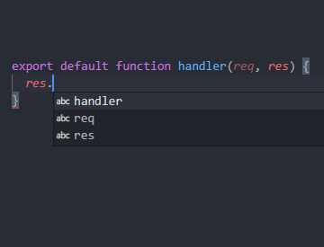
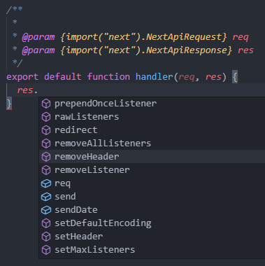

# Server

If there was no server and queries were being done directly, there would be a huge security vulnerability because the secret database key would be open to the public and allow anyone to access it.

A server is needed to execute queries on the database and provide an Application programming interface (API) for the client to fetch data from.


## Server setup

Follow this guide: https://www.mongodb.com/developer/how-to/nextjs-with-mongodb/

Since Next.js has been designed to run on the server, there is minimal set up.

I suggest following [this guide to set up mongodb and make requests to the server](https://www.mongodb.com/developer/how-to/nextjs-with-mongodb/).

There are two ways to fetch data from the server:
1. [Client side fetching (Traditional way)](https://www.mongodb.com/developer/how-to/nextjs-with-mongodb/#example-1--next-js-api-endpoint-with-mongodb).
    - This way, the page loads instantly, but the content isn't there right away
    1. Rendering loading icon
    2. Fetch the data from server
    3. Render the data, remove loading icon
2. [Server side fetching using getServerSideProps](https://www.mongodb.com/developer/how-to/nextjs-with-mongodb/#example-2--next-js-pages-with-mongodb) provided by Next.js.
    - This way, the page will load slower, but it will instantly show all the data from the database. This is also great for SEO.
    - Follow the guide
3. Fetch once with a static fetch
    - using getStaticProps will fetch the data once and build the page to html. This way, data is fetched only once at build time. This is suitable for massive datasets that take more time to fetch.

I recommend trying the first two ways. Stick to server side rendering unless it is too slow. The guide shows examples each of these methods.


-- 


Since servers deal with data, I recommend using TypeScript, but since this will be a small api, you can get intellisense working by using JS docs above the handler function.
```
/**
 *
 * @param {import("next").NextApiRequest} req
 * @param {import("next").NextApiResponse} res
 */
export default function handler(req, res) {
  res.status(200).json({ name: "John Doe" });
}
```

without intellisense:



with intellisense:

